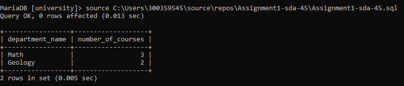
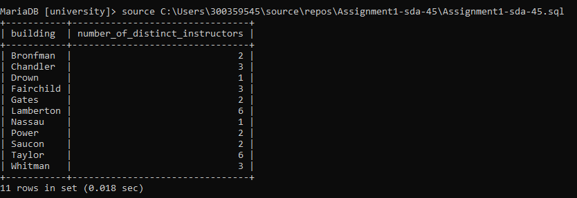
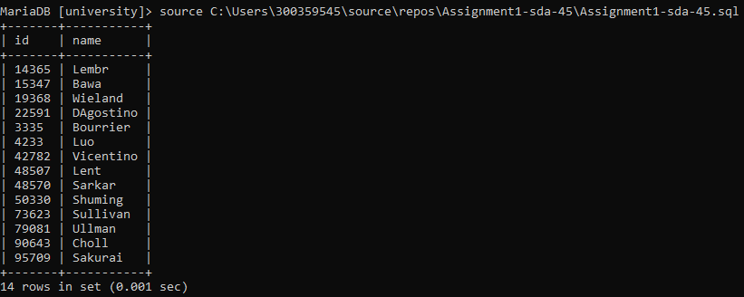
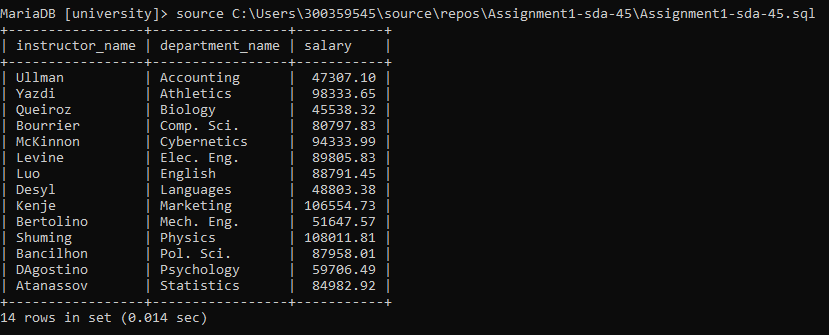
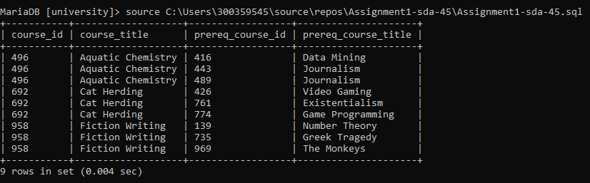
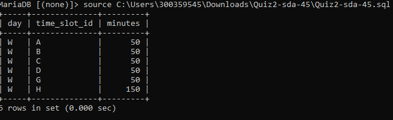
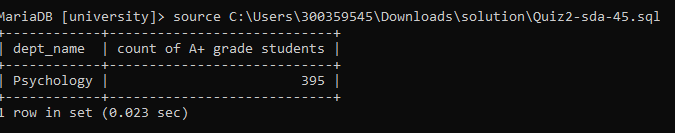

## Queries on University Database

### ER Diagram:


### 1. Create a View that shows the most popular departments by the number of courses offered in 2010;

```
CREATE VIEW most_popular_departments AS
	SELECT department.dept_name as department_name, 
		COUNT(course.course_id) as number_of_courses
			FROM department
				INNER JOIN course 
					ON department.dept_name = course.dept_name
						INNER JOIN section 
							ON course.course_id = section.course_id
								WHERE section.year = '2010'
									GROUP BY department.dept_name
										HAVING COUNT(course.course_id) > 1
											ORDER BY COUNT(course.course_id) DESC;

SELECT * 
	FROM most_popular_departments;

```


Most popular departments are - **Math** and **Geology**


---
___


### 2. For each building, find the number of different instructors who have taught at least one course section in that building since the year 2008. Do not display the building if no instructors have taught there since 2008. The result should display the building name and the number of instructors (give a proper column name). Note: there is more than one table which has a building column, and you need to figure out which one to use.

```
SELECT section.building, 
	COUNT(DISTINCT instructor.ID) AS number_of_distinct_instructors 
		FROM instructor
			INNER JOIN teaches
				ON teaches.ID = instructor.ID
					INNER JOIN section
						ON teaches.sec_id = section.sec_id 
							AND teaches.year = section.year 
								AND teaches.course_id = section.course_id 
									AND teaches.semester = section.semester
										INNER JOIN course 
											ON section.course_id = course.course_id
												WHERE teaches.year >= '2008'
													GROUP BY section.building
														HAVING COUNT(teaches.course_id) >= 1 
															and COUNT(DISTINCT instructor.ID) >= 1


```



---
___


### 3. Find the ID and name of the instructors who taught at least one course in another department. Remove duplicates in the results.

```
SELECT DISTINCT instructor.id, 
	instructor.name 
		FROM instructor
			INNER JOIN teaches
				ON teaches.ID = instructor.ID
					INNER JOIN section
						ON teaches.sec_id = section.sec_id 
							AND teaches.year = section.year 
								AND teaches.course_id = section.course_id 
									AND teaches.semester = section.semester
										INNER JOIN course 
											ON section.course_id = course.course_id
												WHERE instructor.dept_name <> course.dept_name;


```



---
___


### 4. Find the instructors who earn the second highest salary in their own departments. Display the name, department name, and salary of these instructors in alphabetical order of the department name.


```
WITH salary_of_instructors (instructor_name,department_name,salary,i_rank_of_instructor) AS
(
	SELECT instructor.name,
		instructor.dept_name, 
			instructor.salary,
				ROW_NUMBER() OVER(PARTITION BY instructor.dept_name ORDER BY instructor.salary DESC) as rank_of_instructor
					FROM instructor
)
SELECT salary_of_instructors.instructor_name,
	salary_of_instructors.department_name,
		salary_of_instructors.salary
			FROM 
				salary_of_instructors
					WHERE i_rank_of_instructor = 2
						ORDER BY salary_of_instructors.department_name;

```



---
___


### 5.  A list of all the perquisite courses for the course that have more than 2 prerequisites.


```
WITH get_courses_with_more_than_2_prereq (course_id, course_title) AS(
	SELECT course.course_id,
			course.title
				FROM course
					INNER JOIN prereq
						ON course.course_id = prereq.course_id
							GROUP BY course.course_id, course.title
								HAVING COUNT(prereq.prereq_id) > 2
						),

get_prereq_id (course_id, course_title, prereq_course_id) AS(
	SELECT get_courses_with_more_than_2_prereq.course_id,
			get_courses_with_more_than_2_prereq.course_title,
				prereq.prereq_id
					FROM course 
						INNER JOIN prereq
							ON course.course_id = prereq.course_id
								INNER JOIN get_courses_with_more_than_2_prereq 
									ON get_courses_with_more_than_2_prereq.course_id = course.course_id
					)

SELECT get_prereq_id.course_id,
			 get_prereq_id.course_title,
				get_prereq_id.prereq_course_id, 
					course.title AS prereq_course_title
						FROM 
							get_prereq_id 
								INNER JOIN course
									ON course.course_id = get_prereq_id.prereq_course_id;


```




## 6. Find all the courses that advisors are teaching, show the course id, instructor id, instructor name, department, course title and section.


```

SELECT teaches.course_id, 
        instructor.ID, 
        instructor.name, 
        instructor.dept_name, 
        course.title, 
        section.sec_id, 
        section.room_number
	FROM 
        advisor, 
        instructor, 
        teaches, 
        section, 
        course  
	    WHERE 
            instructor.ID = advisor.i_ID
            AND teaches.ID = instructor.ID
            AND teaches.course_id = section.course_id
            AND teaches.sec_id = section.sec_id
            AND teaches.semester = section.semester
            AND teaches.year = section.year
            AND course.course_id = section.course_id;

```


## 7. Get class duration for classes on Wednesday

```
SELECT day, 
		time_slot_id,
		((end_hr - start_hr)*60 + (end_min - start_min)) as minutes
	FROM time_slot
		WHERE day = 'W';
```



## 8. Find the easiest department to take classes with. (having more number of highest grade students)

```
SELECT course.dept_name,
        count(*) as 'count of A+ grade students'
    FROM student, 
        takes, 
        section, 
        course
        WHERE 
        student.ID = takes.ID
        AND takes.course_id = section.course_id
        AND takes.sec_id = section.sec_id
        AND takes.semester = section.semester
        AND takes.year = section.year
        AND section.course_id = course.course_id
        AND takes.grade = 'A+'
            GROUP BY course.dept_name
                ORDER by count(*) DESC
                    LIMIT 1;
```




